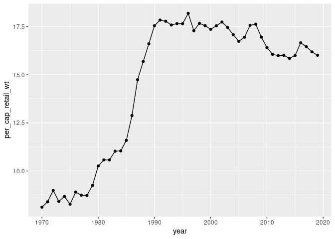
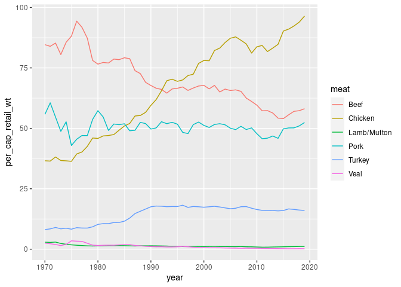
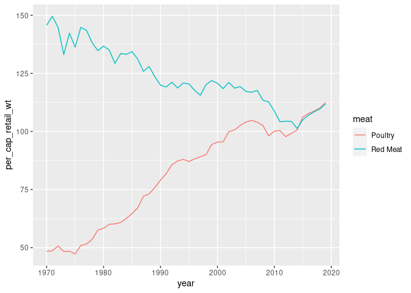

Meat EDA
================
Callan Hoskins
2020-12-16

  - [Turkey](#turkey)
  - [Primary meat types](#primary-meat-types)
  - [Larger meat categories](#larger-meat-categories)

``` r
# Libraries
library(tidyverse)
library(readxl)

# Parameters
raw_data <- here::here("data-raw/meat_consumption.xlsx")
data_path <- here::here("data/meat_consumption.rds")
```

## Turkey

``` r
meat <- read_rds(data_path)
meat
```

    ## # A tibble: 400 x 5
    ##     year meat       per_cap_carcass_wt per_cap_retail_wt per_cap_retail_wt_bone…
    ##    <int> <chr>                   <dbl>             <dbl>                   <dbl>
    ##  1  1970 Beef                   114.               84.6                    79.8 
    ##  2  1970 Chicken                 36.9              36.6                    25.3 
    ##  3  1970 Lamb/Mutt…               3.26              2.90                    2.15
    ##  4  1970 Pork                    72.9              55.8                    48.5 
    ##  5  1970 Poultry                 48.7              48.4                    34.2 
    ##  6  1970 Red Meat               194.              146.                    133.  
    ##  7  1970 Turkey                   8.13              8.13                    6.42
    ##  8  1970 Veal                     2.99              2.48                    2.05
    ##  9  1971 Beef                   113.               83.9                    79.2 
    ## 10  1971 Chicken                 36.7              36.5                    25.1 
    ## # … with 390 more rows

``` r
meat %>% 
  filter(meat == "Turkey") %>% 
  mutate(year = as.integer(year)) %>% 
  ggplot(aes(year, per_cap_retail_wt)) + 
  geom_point() + 
  geom_line()
```

<!-- -->

# Primary meat types

``` r
meat %>% 
  filter(!meat %in% c("Red Meat", "Poultry")) %>% 
  ggplot(aes(year, per_cap_retail_wt, color = meat)) + 
  geom_line()
```

<!-- -->

# Larger meat categories

``` r
meat %>% 
  filter(meat %in% c("Red Meat", "Poultry")) %>% 
  ggplot(aes(year, per_cap_retail_wt, color = meat)) + 
  geom_line()
```

<!-- -->
