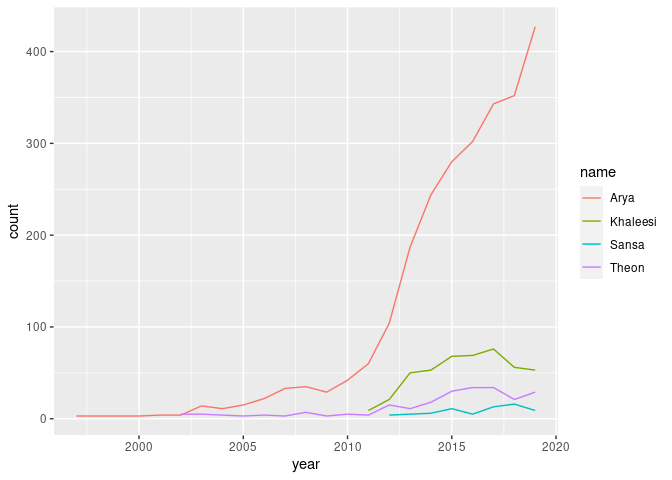
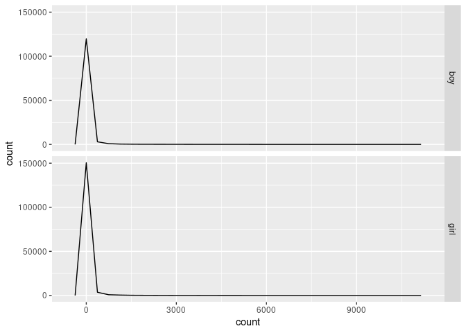
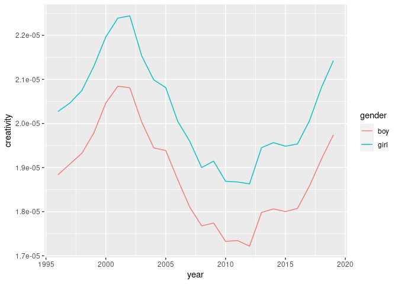

Names EDA
================
Callan Hoskins
2020-12-17

  - [Subsection](#subsection)
  - [Section 2](#section-2)

``` r
# Libraries
library(tidyverse)

# Parameters
names_path <- here::here("data/names.rds")

#===============================================================================

# Code
names <- read_rds(names_path)
```

``` r
names %>% 
  filter(
    (name == "Theon" & gender == "boy") |
      (name == "Sansa" & gender == "girl") |
      (name == "Arya" & gender == "girl") |
      (name == "Khaleesi" & gender == "girl")
    ) %>% 
  ggplot(aes(year, count, color = name)) + 
  geom_line()
```

<!-- -->

``` r
names %>% 
  ggplot(aes(count, color = year)) + 
  facet_grid(rows = vars(gender)) + 
  geom_freqpoly()
```

    ## `stat_bin()` using `bins = 30`. Pick better value with `binwidth`.

<!-- -->

``` r
names %>% 
  group_by(gender, year) %>% 
  mutate(perc_named = count / sum(count)) %>% 
  summarize(creativity = median(perc_named)) %>% 
  ungroup() %>% 
  ggplot(aes(year, creativity, color = gender)) + 
  geom_line()
```

    ## `summarise()` regrouping output by 'gender' (override with `.groups` argument)

<!-- -->

### Subsection

## Section 2
