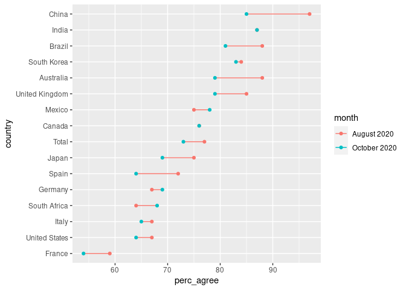
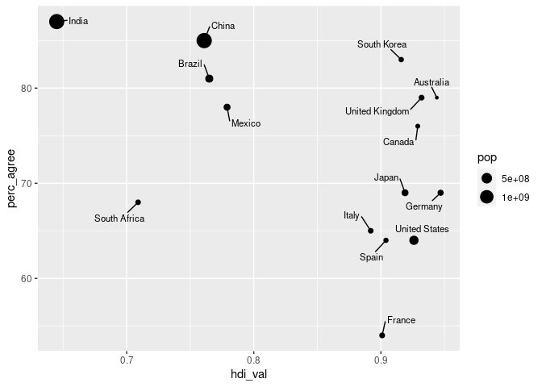

Vaccine acceptability
================
Callan Hoskins
2020-12-19

``` r
# Libraries
library(tidyverse)

# Parameters
data_path <- here::here("data-raw/vaccines.csv")

#===============================================================================

# Code
data <- 
  data_path %>% 
  read_csv(
    col_names = c("country", "august", "october"), 
    skip = 1
  ) %>% 
  arrange(desc(october)) %>% 
  pivot_longer(
    cols = c("august", "october"), 
    names_to = "month", 
    values_to = "perc_agree"
  ) %>% 
  mutate(month = month %>% str_to_title() %>% str_c(" 2020"))
```

``` r
data %>% 
  mutate(country = country %>% fct_reorder(perc_agree)) %>% 
  ggplot(aes(country, perc_agree, color = month)) + 
  geom_line(aes(group = country)) + 
  geom_point() + 
  coord_flip() 
```

<!-- -->

``` r
hdi_path <- here::here("data-raw/un_hdi_2019.xlsx")

library(readxl)

col_names <- 
  c(
    "country_rank" = "...1", 
    "country" = "...2", 
    "hdi_val" = "Human Development Index (HDI)", 
    "life_exp_at_birth" = "Life expectancy at birth", 
    "exp_yrs_school" = "Expected years of schooling", 
    "gni_per_cap" = "Gross national income (GNI) per capita", 
    "gni_per_cap_minus_hdi_rank" = "GNI per capita rank minus HDI rank"
    )

hdi <- 
  read_excel(hdi_path, skip = 4) %>% 
  select(!!! col_names) %>% 
  mutate(
    country_rank = country_rank %>% as.integer(), 
    hdi_val = hdi_val %>% as.double(), 
    life_exp_at_birth = life_exp_at_birth %>% as.double(), 
    exp_yrs_school = exp_yrs_school %>% as.double(), 
    gni_per_cap = gni_per_cap %>% as.double(), 
    gni_per_cap_minus_hdi_rank = gni_per_cap_minus_hdi_rank %>% as.integer()
  ) %>% 
  drop_na(country_rank) %>% 
  mutate(
    country = 
      case_when(
        country == "Hong Kong, China (SAR)" ~ "China", 
        country == "Korea (Republic of)" ~ "South Korea", 
        TRUE ~ country
      )
  )
```

    ## New names:
    ## * `` -> ...1
    ## * `` -> ...2
    ## * `` -> ...4
    ## * `` -> ...6
    ## * `` -> ...8
    ## * ...

    ## Warning: Problem with `mutate()` input `country_rank`.
    ## ℹ NAs introduced by coercion
    ## ℹ Input `country_rank` is `country_rank %>% as.integer()`.

    ## Warning in function_list[[k]](value): NAs introduced by coercion

    ## Warning: Problem with `mutate()` input `hdi_val`.
    ## ℹ NAs introduced by coercion
    ## ℹ Input `hdi_val` is `hdi_val %>% as.double()`.

    ## Warning in function_list[[k]](value): NAs introduced by coercion

    ## Warning: Problem with `mutate()` input `life_exp_at_birth`.
    ## ℹ NAs introduced by coercion
    ## ℹ Input `life_exp_at_birth` is `life_exp_at_birth %>% as.double()`.

    ## Warning in function_list[[k]](value): NAs introduced by coercion

    ## Warning: Problem with `mutate()` input `exp_yrs_school`.
    ## ℹ NAs introduced by coercion
    ## ℹ Input `exp_yrs_school` is `exp_yrs_school %>% as.double()`.

    ## Warning in function_list[[k]](value): NAs introduced by coercion

    ## Warning: Problem with `mutate()` input `gni_per_cap`.
    ## ℹ NAs introduced by coercion
    ## ℹ Input `gni_per_cap` is `gni_per_cap %>% as.double()`.

    ## Warning in function_list[[k]](value): NAs introduced by coercion

    ## Warning: Problem with `mutate()` input `gni_per_cap_minus_hdi_rank`.
    ## ℹ NAs introduced by coercion
    ## ℹ Input `gni_per_cap_minus_hdi_rank` is `gni_per_cap_minus_hdi_rank %>% as.integer()`.

    ## Warning in function_list[[k]](value): NAs introduced by coercion

``` r
pop_path <- here::here("data-raw/world_populations.csv")

populations <- 
  read_csv(pop_path, skip = 4) %>% 
  select(country = `Country Name`, `1960`:`2019`) %>% 
  pivot_longer(cols = `1960`:`2019`, names_to = "year", values_to = "pop") %>% 
  mutate(year = year %>% as.integer())
```

    ## Warning: Missing column names filled in: 'X66' [66]

    ## 
    ## ── Column specification ───────────────────────────────────────────────────────────────────────────────────────────────────────────────────────────────────────────────
    ## cols(
    ##   .default = col_double(),
    ##   `Country Name` = col_character(),
    ##   `Country Code` = col_character(),
    ##   `Indicator Name` = col_character(),
    ##   `Indicator Code` = col_character(),
    ##   `2020` = col_logical(),
    ##   X66 = col_logical()
    ## )
    ## ℹ Use `spec()` for the full column specifications.

``` r
populations
```

    ## # A tibble: 15,840 x 3
    ##    country  year   pop
    ##    <chr>   <int> <dbl>
    ##  1 Aruba    1960 54211
    ##  2 Aruba    1961 55438
    ##  3 Aruba    1962 56225
    ##  4 Aruba    1963 56695
    ##  5 Aruba    1964 57032
    ##  6 Aruba    1965 57360
    ##  7 Aruba    1966 57715
    ##  8 Aruba    1967 58055
    ##  9 Aruba    1968 58386
    ## 10 Aruba    1969 58726
    ## # … with 15,830 more rows

``` r
populations <- 
  read_rds(here::here("data/world_populations.rds"))
hdi <- 
  read_rds(here::here("data/un_hdi_2019.rds"))
hdi
```

    ## # A tibble: 189 x 7
    ##    country_rank country hdi_val life_exp_at_bir… exp_yrs_school gni_per_cap
    ##           <int> <chr>     <dbl>            <dbl>          <dbl>       <dbl>
    ##  1            1 Norway    0.957             82.4           18.1      66494.
    ##  2            2 Ireland   0.955             82.3           18.7      68371.
    ##  3            2 Switze…   0.955             83.8           16.3      69394.
    ##  4            4 Hong K…   0.949             84.9           16.9      62985.
    ##  5            4 Iceland   0.949             83.0           19.1      54682.
    ##  6            6 Germany   0.947             81.3           17.0      55314.
    ##  7            7 Sweden    0.945             82.8           19.5      54508.
    ##  8            8 Austra…   0.944             83.4           22.0      48085.
    ##  9            8 Nether…   0.944             82.3           18.5      57707.
    ## 10           10 Denmark   0.94              80.9           18.9      58662.
    ## # … with 179 more rows, and 1 more variable: gni_per_cap_minus_hdi_rank <int>

``` r
all <- 
  data %>% 
  inner_join(hdi) %>% 
  inner_join(populations %>% filter(year == 2019))
```

    ## Joining, by = "country"
    ## Joining, by = "country"

``` r
library(ggrepel)

all %>% 
  filter(month == "October 2020") %>% 
  ggplot(aes(hdi_val, perc_agree)) + 
  geom_point(aes(size = pop)) + 
  geom_text_repel(aes(label = country), force = 2, box.padding = 0.7, size = 3)
```

<!-- -->
