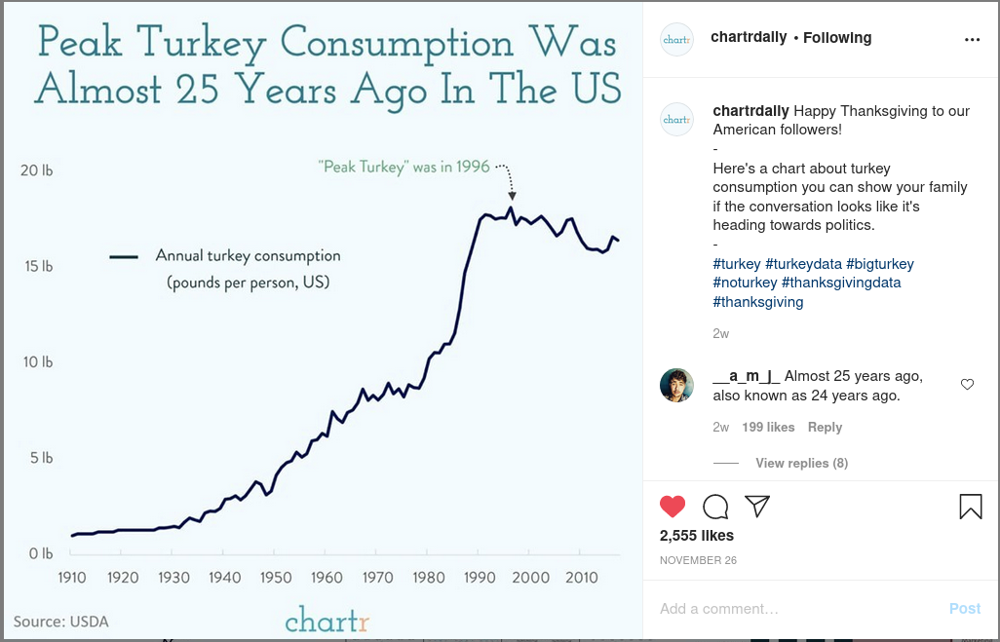
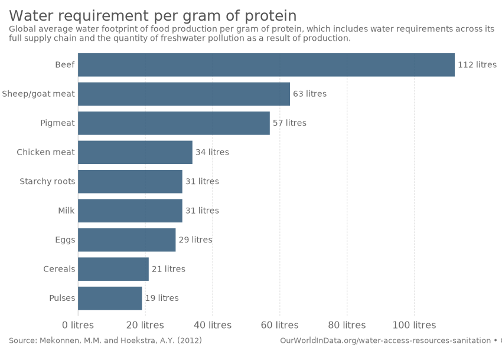
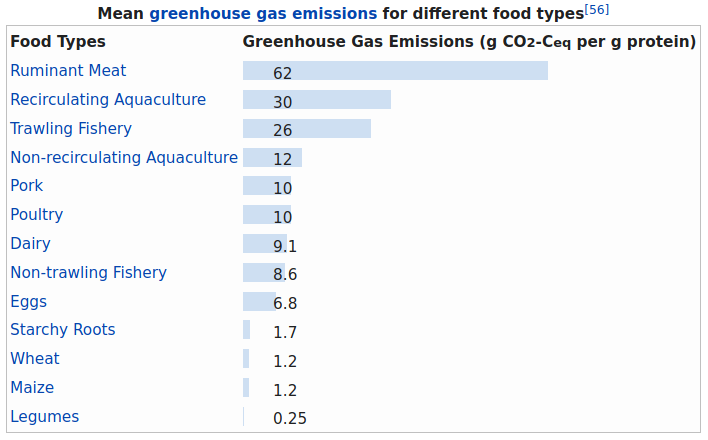
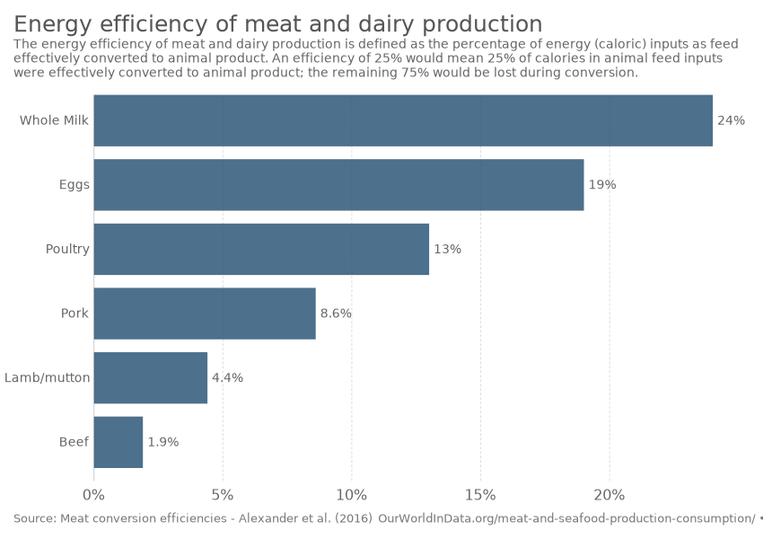
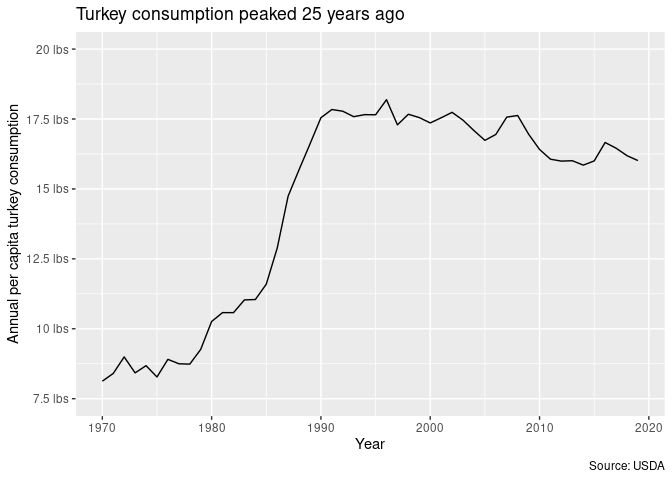
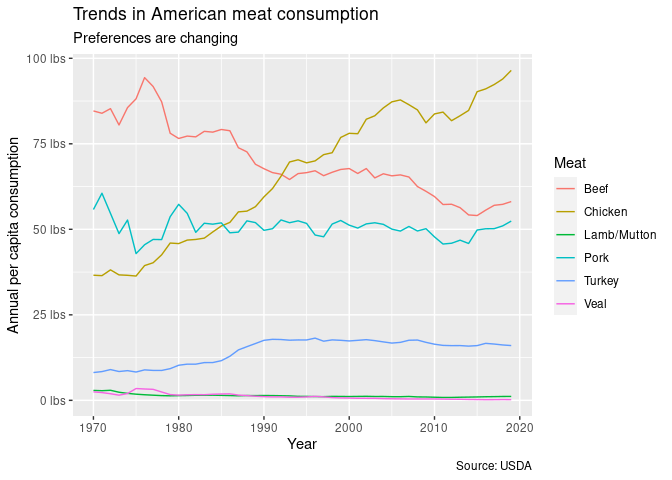
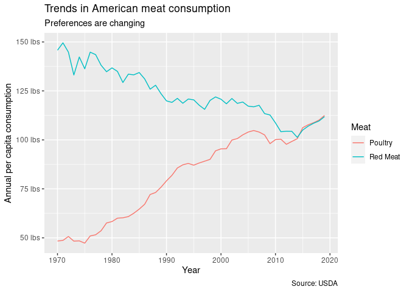

Meat Consumption Trends
================
Callan Hoskins
2020-12-17

  - [Introduction](#introduction)
  - [Thanksgiving](#thanksgiving)
  - [Comparing types of meat](#comparing-types-of-meat)
  - [Poultry vs. Red Meat](#poultry-vs.-red-meat)

# Introduction

I was inspired to check out this data by the instagram page
“chartrdaily,” who on Thanksgiving posted this visualization to their
channel: 

In general, meat consumption is both a cultural value that changes over
time and an important driving factor in greenhouse gas emissions.
Raising animals is not very water- or energy-efficient, which has fueled
a recent push away from the worst types of meat not for animal rights
issues but for environmental ones.

Beef both requires the most water and produces the most greenhouse
gases: 

And for this reason, beef is the least energy-efficient meat, followed
by mutton, pork, and then poultry.

Environmentally, we would prefer to transition to eating more
poultry/pork and less beef/mutton. In this data analysis, I will examine
whether that transition to poultry and pork has been happening.

# Thanksgiving

To begin, I recreate the chart displayed by chartrdaily: annual
per-capita turkey consumption over time.

<!-- -->
Though we imagine a Thanksgiving turkey as a quintessential American
tradition, it appears that it’s actually a relatively new tradition,
with the idea really taking off during the 1980s in particular. Since
then, Americans seem to have been finding replacements for the Big Bird.
Personally, I say good riddance\!

# Comparing types of meat

When I originally saw that graphic, I wondered how turkey consumption
compares to consumption of other types of meat over time (beef, pork,
and chicken in particular). I suspected that it has never really
compared, as turkey is mainly a lunchmeat with one day in the limelight
each year.
<!-- -->

In 1970, beef was king in America. However, only six years later it
would hit its peak per-capita consumption and twenty-two years later
chicken surpassed it as Americans’ most consumed meat. In fact, since
1970 there has been a consistently decreasing trend in beef consumption
– a decrease that is healthier for Americans and for the environment
in general. Meanwhile, pork consumption has remained almost constant
during the time period examined.

Turkey has always been consumed far less than beef or chicken, but still
far more than either veal or lamb/mutton (neither of which is consumed
in any meaningful amount).

Since fish is not farmed in the same was as livestock are, the USDA
doesn’t keep statistics on them, but I suspect that, if we could include
pounds of fish consumed on this graph, we would see a rapid increase
over this time period as well.

# Poultry vs. Red Meat

Poultry is significantly better for the environment than red meat is. As
such, I want to compare consumption of red meat vs. poultry to see how
Americans’ meat preferences have impacted the environment. Based on the
previous graph, I expect that the two will have a similar relationship
to the one between chicken and beef.

<!-- -->

Because poultry is made up of turkey and chicken and red meat is pork
and beef, the relationship between red meat vs. poultry is no the same
as beef vs. chicken. Red meat remained buoyed by pork’s consistent
popularity until this decade, in which it looks like poultry is starting
to overtake red meat as the preferred American meat type.

Americans’ consumption of red meat has been consistently decreasing
since 1970, while their consumption of poultry has been increasing to
replace it. I, for one, avoid red meat when I can and this plot shows
that many Americans are making that same decision year after year. This
is good news for the planet and for Americans’ health too.
