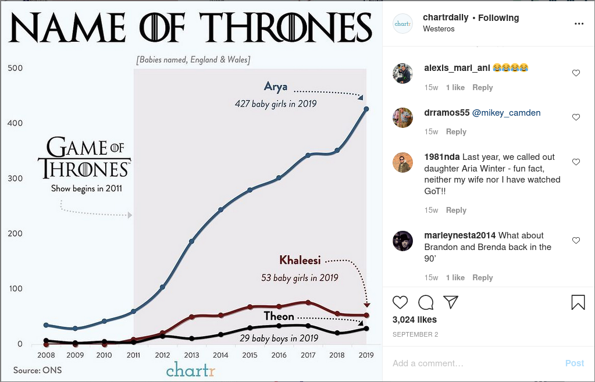
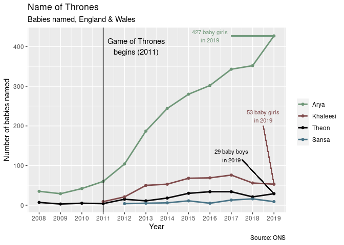
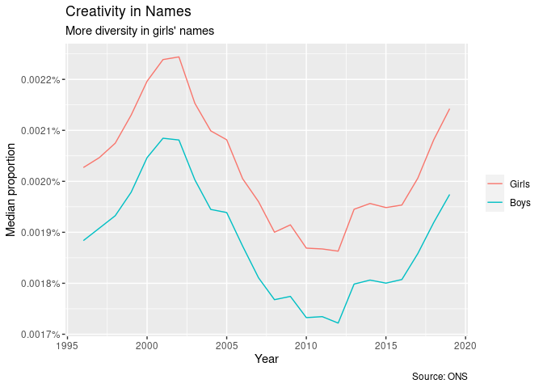

British names
================
Callan Hoskins
2020-12-17

  - [Introduction](#introduction)
  - [Name of Thrones](#name-of-thrones)
  - [Creativity](#creativity)

# Introduction

*Game of Thrones* was one of the most successful TV franchises of the
twenty-first century. I didn’t start watching it until it was already
done, but before that I remember it being the topic of every few
conversations (I always felt left out\!). The show was such a hit that
it prompted @chartrdaily to examine whether it had impacted how Brits
were naming their babies. Turns out, it did\!

In this project, I set out to recreate their visualization and to see
whether Brits were becoming more or less creative with their babies’
names.

# Name of Thrones

In addition to the names examined by @chartrdaily, I also chose to check
out “Sansa,” another very unique name from Game of Thrones. Other than
that, my plot is a re-creation of the original.

<!-- -->
Unsurprisingly, the incidences of people naming their children Arya,
Khaleesi, and Theon has gone up. Interestingly, Sansa shows a slight
rise but nothing noticeable; I think this is strange because Sansa is a
really pretty name. To be honest, I don’t know *why* anyone would name
their child “Theon” based on the character in the show\!

# Creativity

It’s no secret that certain names are more popular than others… the
number of Jack’s, Oliver’s, and Dan’s one meets on a daily basis is far
larger than the number of Aarden’s, Cayan’s, and Deniro’s.

I think it’s cool to see people get creative with the names they give
their kids (maybe because mine, “Callan,” is pretty unique). So I’m
interested to see how the creativity of people’s naming has changed
throughout time.

As a proxy for creativity, I use the median proportion of babies with a
given name. This normalizes the creativity measure with respect to the
total number of babies named each year.

<!-- -->

Interestingly, parents seem to draw from a consistently more diverse
array of names when naming girls vs. boys. They get more “creative” with
girls’ names.

Additionally, parents peaked in their creativity naming both boys and
girls around 2000 and hit a 20-year low in 2012. Sorry all you Olivers
out there born in 2012.
