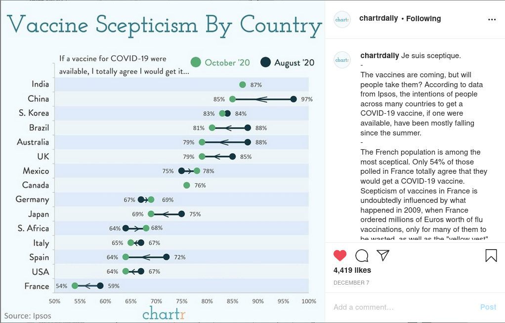

```{r setup, include=FALSE}
knitr::opts_chunk$set(echo = FALSE, message = FALSE, warning = FALSE)
```

```{r message=FALSE, warning=FALSE}
# Libraries
library(tidyverse)
library(ggrepel)

# Parameters
vaccines_path <- here::here("data/vaccines.rds") 
hdi_path <- here::here("data/un_hdi_2019.rds")
pop_path <- here::here("data/world_populations.rds")

#===============================================================================

# Code
vaccines <- read_rds(vaccines_path)
hdi <- read_rds(hdi_path)
populations <- read_rds(pop_path)
```

# Introduction

The COVID pandemic has claimed millions of lives and disrupted the lives of almost everone on the planet. 

But now, in December 2020, we are starting to see hope for the end: a vaccine (actually, multiple vaccines from different companies)! In order for the vaccines to really work, a large proportion (I've heard 70%) of the population needs to be vaccinated, to obtain herd immunity. 

However, due to the rapid pace of the vaccine's development, this vaccine has its fair share of critics who claim that taking the vaccine will do more harm to them than the virus would anyway, and who claim that they will not take it. 

Recently, \@chartrdaily published this visualization that shows the changing opinions on the vaccine between a little over a dozen countries: 

In this data analysis, I aim to re-create this visualization as well as see if I can identify any relationship between the size/wealth of a country and its vaccine skepticism. 

# Vaccine Skepticism

This is a reproduction of \@chartrdaily's work on vaccine skepticism compared between different countries.

```{r}
vaccines %>% 
  filter(country != "Total") %>% 
  mutate(country = country %>% as.factor() %>% fct_reorder(perc_agree, mean)) %>% 
  ggplot(aes(country, perc_agree, color = month)) + 
  geom_point() + 
  geom_line(
    data =
      . %>%
      group_by(country) %>%
      filter(abs(perc_agree - mean(perc_agree)) > 0.5) %>%
      mutate(
        perc_agree = case_when(
          month == "October 2020" & perc_agree == min(perc_agree) ~ perc_agree + 0.4,
          month == "October 2020" ~ perc_agree - 0.4,
          month == "August 2020" & perc_agree == min(perc_agree) ~ perc_agree + 0.24, 
          TRUE ~ perc_agree - 0.24
        )
      ) %>% 
      ungroup(), 
    mapping = aes(group = country),
    color = "black",
    arrow = arrow(length = unit(0.15, "cm")), 
    alpha = 0.5
  ) +
  scale_y_continuous(
    labels = scales::label_percent(scale = 1), 
    limits = c(50, 100)
  ) + 
  coord_flip() + 
  labs(
    x = NULL, 
    y = "Percent of respondents who plan to get the COVID vaccine", 
    title = "COVID Vaccine Skepticism by Country", 
    caption = "Source: Ipsos", 
    color = NULL
  )
```

# Effect of wealth, size, and education on vaccine skepticism

Though we can't *prove* anything through straight-up data analysis, I thought it would be interesting to look at attitudes toward the vaccine in relation to countries' socioeconomic status. 

To do this, I used the data above from Ipsos as well as HDI/education data from the United Nations and population data from the World Bank to create the plot below: 

```{r}
vaccines %>% 
  filter(month == "October 2020") %>% 
  inner_join(populations %>% filter(year == 2019)) %>% 
  inner_join(hdi) %>% 
  ggplot(aes(hdi_val, perc_agree)) + 
  geom_text_repel(aes(label = country), force = 2, box.padding = 0.7, size = 3) + 
  geom_point(aes(size = pop, color = exp_yrs_school)) + 
  scale_size(
    breaks = c(0.5e8, 1e8, 5e8, 1e9), 
    labels = scales::label_number(scale = 1e-6, suffix = " million", accuracy = 1)
  ) + 
  scale_color_viridis_c(breaks = seq(12, 24, 3), limits = c(11, 25)) + 
  labs(
    title = "Which Countries Are Willing to Get Vaccinated?", 
    subtitle = "More educated, developed countries more hesitant", 
    x = "UN Human Development Index Value (0 - 1)", 
    y = "Percentage of respondents willing to be vaccinated", 
    caption = "Source: Ipsos", 
    size = "Population", 
    color = "Expected number of years in school"
  ) + 
  theme_minimal()
```

Interestingly, the more developed countries seem to be more hesitant to receive the vaccine. These countries also tend to be the ones who are more educated. This is in line with the demographics of anti-vaxxers before the epidemic, who, at least in the United States, tend to be upper- or middle-class and well-educated. 

Additionally, we see that several of the nations with the highest death tolls from the virus (United States, Italy, Spain) have some of the lowest confidence in the vaccine, whereas a country like Australia (that has basically avoided the virus) has high rates of planned compliance. This may signal that people in the United States, Italy, and Spain have lost faith in their governments' public health systems. 

