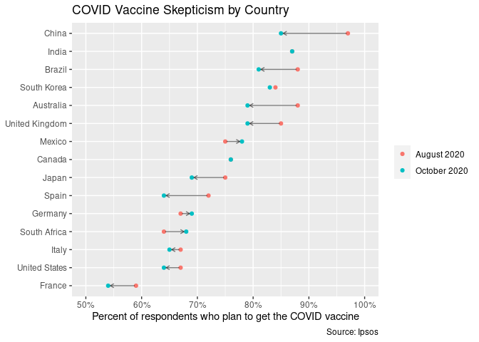
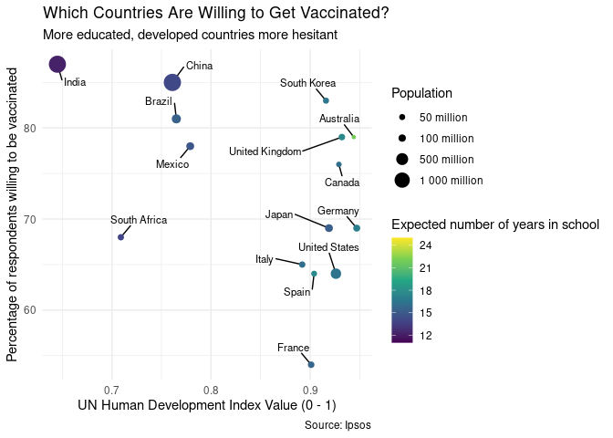

Vaccine skepticism
================
Callan Hoskins
2020-12-19

  - [Introduction](#introduction)
  - [Vaccine Skepticism](#vaccine-skepticism)
  - [Effect of wealth, size, and education on vaccine
    skepticism](#effect-of-wealth-size-and-education-on-vaccine-skepticism)

# Introduction

The COVID pandemic has claimed millions of lives and disrupted the lives
of almost everone on the planet.

But now, in December 2020, we are starting to see hope for the end: a
vaccine (actually, multiple vaccines from different companies)\! In
order for the vaccines to really work, a large proportion (I’ve heard
70%) of the population needs to be vaccinated, to obtain herd immunity.

However, due to the rapid pace of the vaccine’s development, this
vaccine has its fair share of critics who claim that taking the vaccine
will do more harm to them than the virus would anyway, and who claim
that they will not take it.

Recently, @chartrdaily published this visualization that shows the
changing opinions on the vaccine between a little over a dozen
countries: 

In this data analysis, I aim to re-create this visualization as well as
see if I can identify any relationship between the size/wealth of a
country and its vaccine skepticism.

# Vaccine Skepticism

This is a reproduction of @chartrdaily’s work on vaccine skepticism
compared between different countries.

<!-- -->

# Effect of wealth, size, and education on vaccine skepticism

Though we can’t *prove* anything through straight-up data analysis, I
thought it would be interesting to look at attitudes toward the vaccine
in relation to countries’ socioeconomic status.

To do this, I used the data above from Ipsos as well as HDI/education
data from the United Nations and population data from the World Bank to
create the plot below:

<!-- -->

Interestingly, the more developed countries seem to be more hesitant to
receive the vaccine. These countries also tend to be the ones who are
more educated. This is in line with the demographics of anti-vaxxers
before the epidemic, who, at least in the United States, tend to be
upper- or middle-class and well-educated.

Additionally, we see that several of the nations with the highest death
tolls from the virus (United States, Italy, Spain) have some of the
lowest confidence in the vaccine, whereas a country like Australia (that
has basically avoided the virus) has high rates of planned compliance.
This may signal that people in the United States, Italy, and Spain have
lost faith in their governments’ public health systems.
